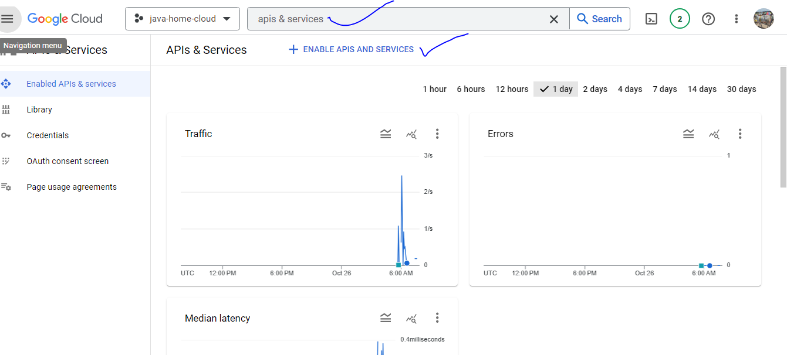
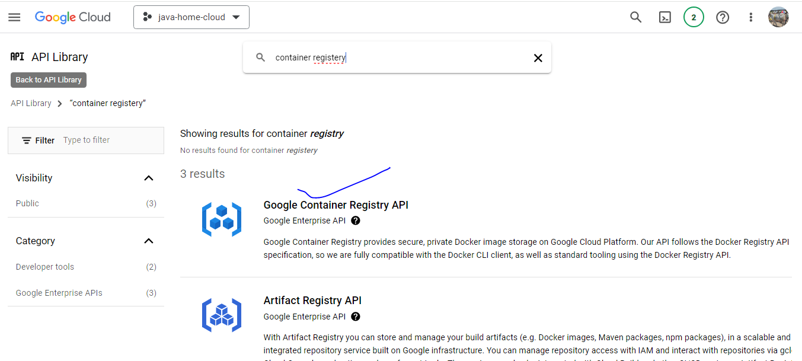
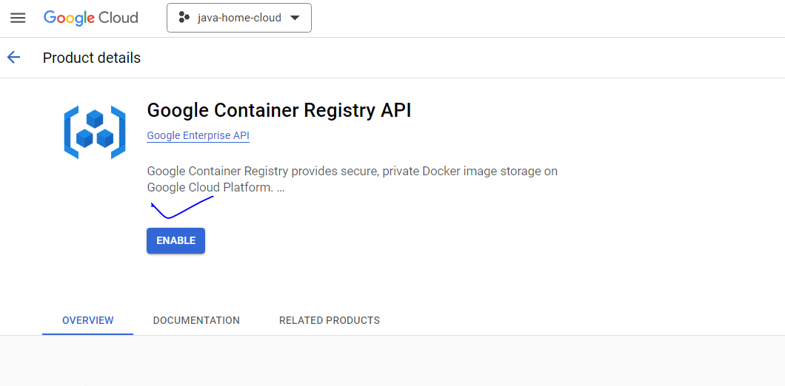

## google lcoud class-1 notes

* GCP organisation strcutre image

* in the above, you can understood, __GCP__ start __organisation__
  * under the below __folder__
    * there is possibleity to create  __folder__ "inside the folder"
    * Under the __folder__ ,  we can createe __projects__
    * each __resource __ belongs to __project__

## GCP projet notes

* project name, project id, project number
* project name cane change at a nay tme
* project id --> we can chnage, we can give any name at the time of creating project
* project number will be givem by __google cloud__, it can chnage , upto life time of prioject
* each project is linked on billing account otherwsie __GCP__ does not aloow to create resources.
  * if __billing account__ is "not active" state, then __GCP does not allow to create resources__.

## GCP enable API concept

* to use any GCP service __frist we need to enable "API"__
  * to enable that  there ia GCp service __API & services__
  * to that service, seacrch for resspecive API
  * for  example the below image 

  * click on the "eanble api service" 
    * for example __google  contianer registery__  , search for container registery

    *  click  on "contianer registery"

* in the same way __we can disable__ api, if we do not want ot use that service.
