## google lcoud class-1 notes

* GCP organisation strcutre image


* in the above, you can understood, __GCP__ start __organisation__
  * under the below __folder__
    * there is possibleity to create  __folder__ "inside the folder"
    * Under the __folder__ ,  we can createe __projects__
    * each __resource __ belongs to __project__

## GCP projet notes

* project name, project id, project number
* project name cane change at a nay tme
* project id --> we can chnage, we can give any name at the time of creating project
* project number will be givem by __google cloud__, it can chnage , upto life time of prioject
* each project is linked on billing account otherwsie __GCP__ does not aloow to create resources.
  * if __billing account__ is "not active" state, then __GCP does not allow to create resources__.

## GCP enable API concept


* to use any GCP service __frist we need to enable "API"__
  * to enable that  there ia GCp service __API & services__
  * to that service, seacrch for resspecive API
  * for  example the below image 


  * click on the "eanble api service" 
    * for example __google  contianer registery__  , search for container registery


    *  click  on "contianer registery"


* in the same way __we can disable__ api, if we do not want ot use that service.


### compute engine

* it is  simliamr to AWS Ec2 servive
* to use compute service -- >first we need "enable" compute engine api

* whenever enable  __compute engineer api__, it will automatically create one "sercive account "at IAM-admin" GCP service.

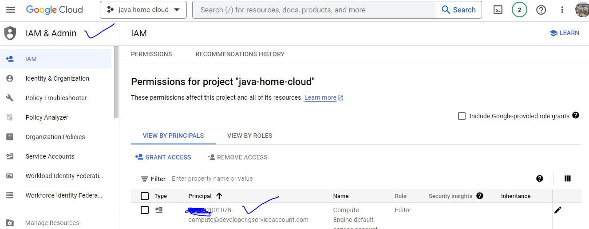

 ## create simple "ubuntu" instance & install apche webser , access fromw internrt

* click on "create instance"
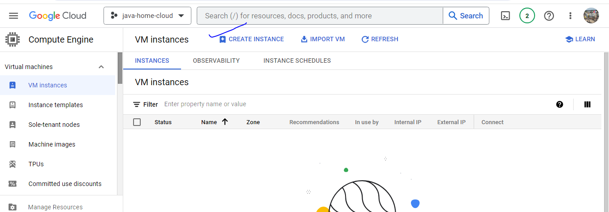

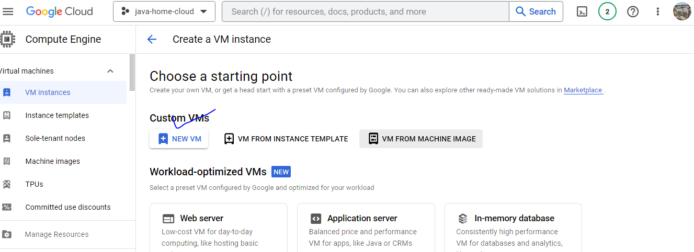

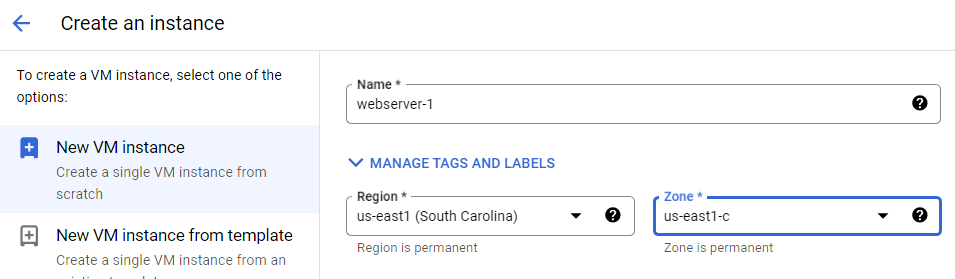

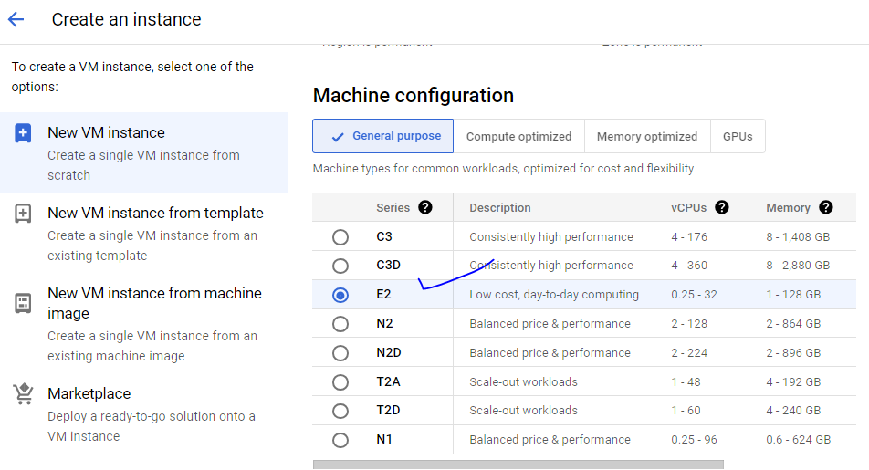

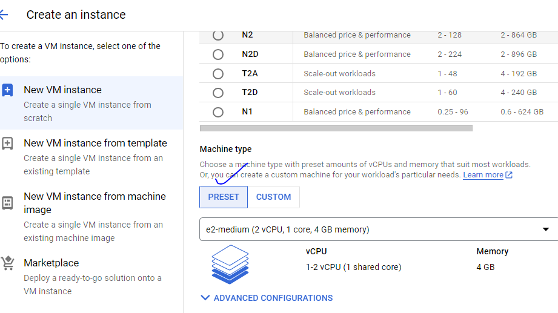

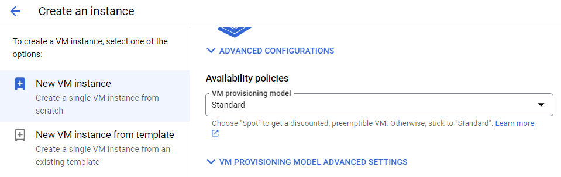

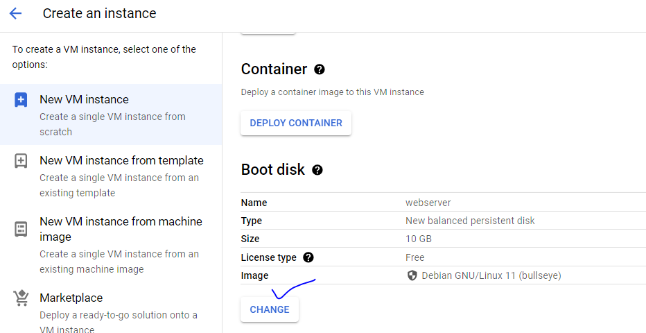

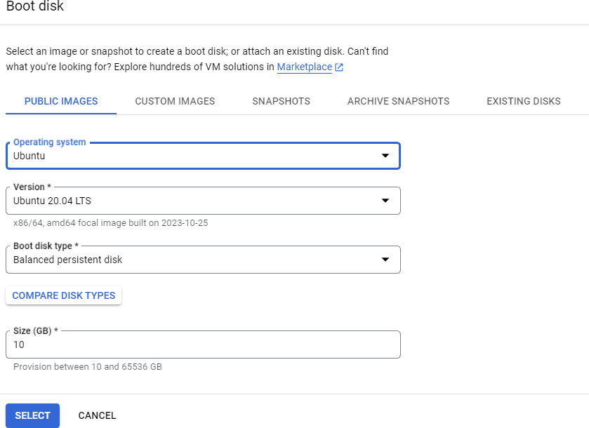

* remaing things "leave" as default

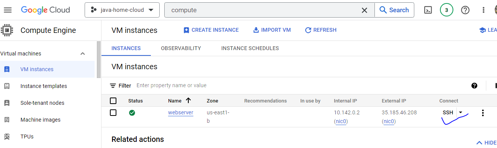

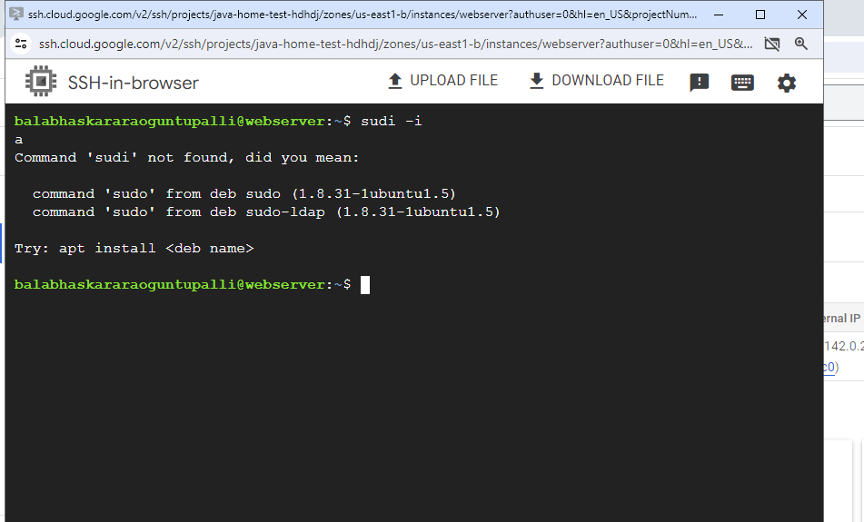

* run the flollowing commandas to intall _-apache2 webserver in the VM

```
sudo apt update
sudo apt install apache2 -y
sudo systemctl enable apache2.service
```


* copy __public IP__ of the in the browser , it unable to dispaly  the webapage, because 80 port is not opened to internet.


* to open 80 port, we  need to create __firewall__ at __VPC__ service.

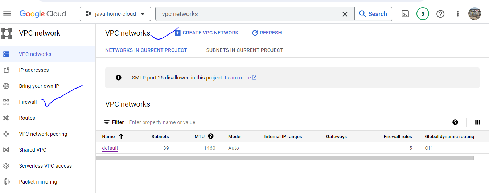

* click on __firewall__

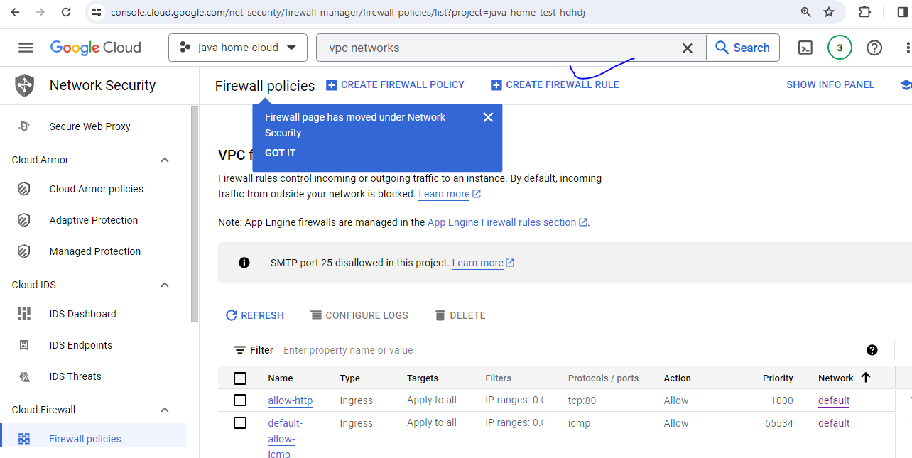


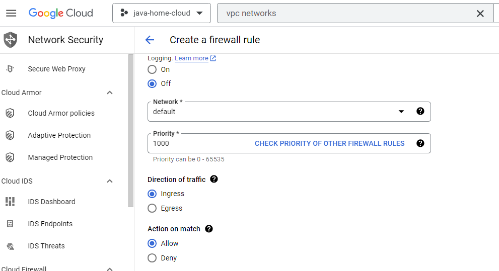

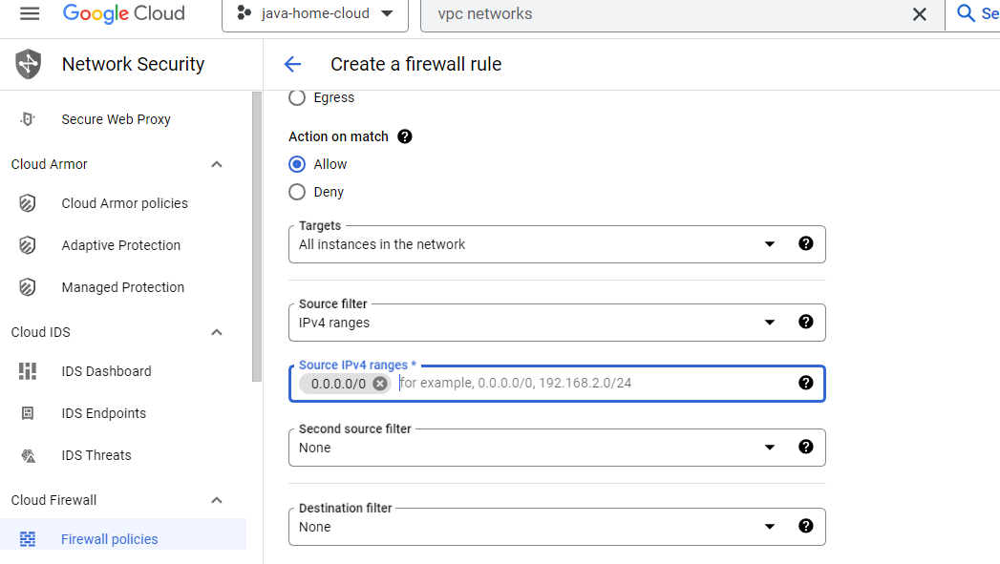

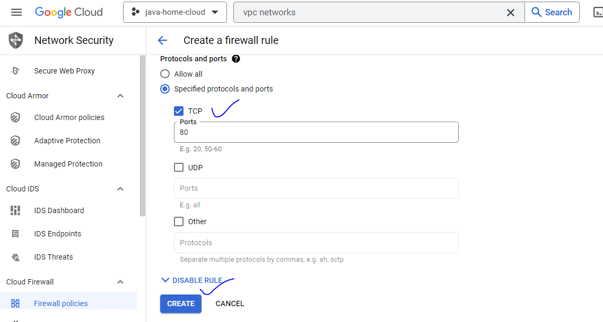


* now 80 port is opned. web page is dispaled from internet.


