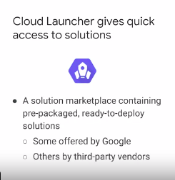

## GCP compute notes

* VM resouce costs are per second biiling.

* Resources that live in a zone are referred to as zonal resources. Virtual machine Instances and persistent disks live in a zone. To attach a persistent disk to a virtual machine instance, both resources must be in the same zone. Similarly, if you want to assign a static IP address to an instance, the instance must be in the same region as the static IP.

## Marketplace (formerly Cloud Launcher)

Note: If we any deployment from "marketplace", it use "deployment manager" to do deployment.

Deployment manager is GCP IAAC service.

