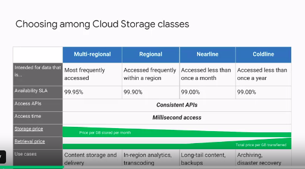

# google cloud storage service

## cloudStorage

Table contents
 * 1. use cases
 * 2. cloud storage types
 * 3. Object life cycle managements 

## use cases
* content storage and delivery
* storage data for data analytics and general compute
* backup and archival storage

### cloud storage types

* go through the below image

   * cloud storage types are
        * multi regional
        * regional
        * nearline
        * coldline      --> similar to AWS glacier
      
      * multi regional: to storage in multiple regions, to fast access data in multiple regions
      * regional : In this type data is stored in one regions, access of data is fast in that region only.

### Object life cycle management
* It means we can change storage type from one stroage type to another storage type.
* example: move storage type from multi region to nearline storage type.
* In cloud storage is organized into buckets. Bucket name is globally unique.
* use IAM polices or "access control lists" to control buckets and objects in cloud storage.

