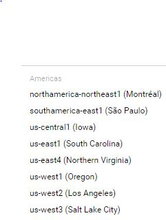
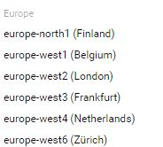
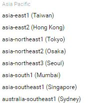

## gcp neworking are dived into 3 types.
```
1. multi region
2. region
3. zones
```

## multi region
```
Multi region is nothin but group of regions. they are named as 1. AMERICA, 2. Europe 3. ASIA pacific
```



## regions
```
region meaning group in zones  in the same country
```

## zone
``` 
zone is nothing but group of data centers in the within  in the  region
