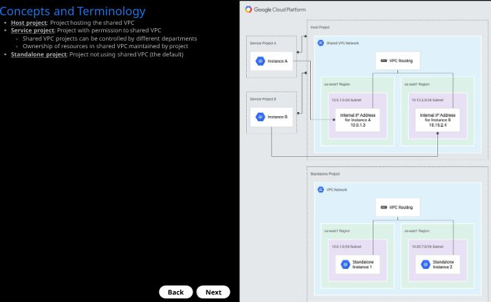
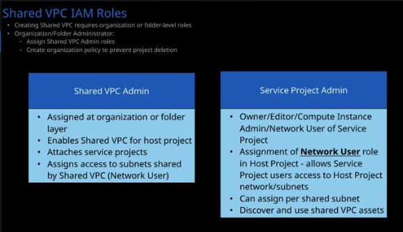
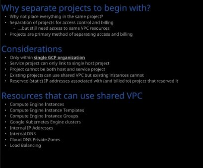

# Shared VPC in GCP

### shared VPC definition
* vpc is which share accross multile projects in a organisation. it can also be called as "cross projetc networking."
* refer the below image

### shared VPC core concepts

### shared VPC IAM roles

* refer the below image to know about shared VPC IAM roles

### why separate projects to begin with

